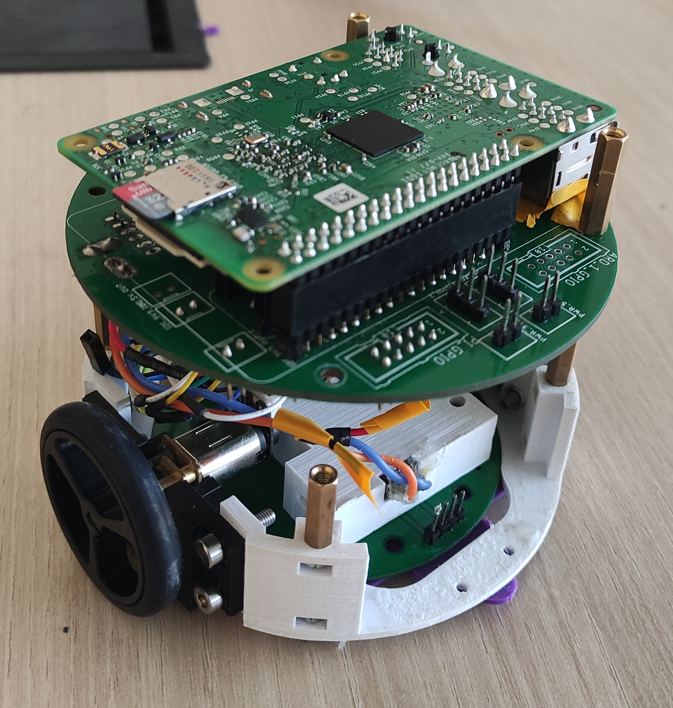

I have worked with swarm robotics during my recent internship by exploiting the ROS framework. In order to run either the simulation or control the robots' behavior, first a ROS package should be created. Using zsh or bash commands in Ubuntu, we can display the simulation environment of ROS. This task included altering the variables of the simulation throughout the YML files. In the next steps, the algorithm for randomizing the initial position of drones was redesigned. The main algorithm for drones to keep moving was the flocking algorithm, though drones' dynamic acts could have been controlled by various patterns implementing the corresponding Python code. Here is a sample video of the drone's simulation trying to converge with the help of the flocking algorithm.
Furthermore, enhancing the simulation created by ROS on Ubuntu OS had its limitations. Thereby, to address this issue Docker comes in. Docker is considered to be a virtual machine action as an alternative to other operating systems. In order to send out the needed scripts to Docker in a realtime, Socket protocol was utilized. This networking type simply consisted of a client and a server sharing the same IP and port. the client was responsible for sending out the data while the server received it in bytes format. there should be a deserialization conversion to alter the byte format to its original format.

<video src="../images/flocking.mp4" alt="simulation" width="640" height="480" align="right" controls></video>

Additionally, I made another ROS pocket for controling the robot's behavior in the real environment. The drones were elemantary robots working with a collaboration of Arduino and Raspberry Pi boards. Xbee module was implemented in order to organize networking connections between robots. Robots' behaviors and commands were controlled with rostopics. To be precise, to perform the simple task of moving a robot from one point to a desired destination, coordinates were subscribed by a node and alternatively the error vector was obtained by these received data (the coourdinates can be acquired either with Odometer or Kalvan cameras). The error vector gets published and correspondigly another ros node which is responsible for converting the linear velocity to angular velocity, subscribes the message. Final data are published to DC motors. This approach is build on a simple closed-loop proportional controller.  

<!--  -->

  

