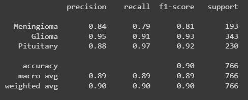

During my course work in Deep Learning, I gained tremendous experience of neural nets and their vitality for classification matters. Moreover, I got familiar with generative models like Autoencoders, Variational Autoencoders, and GAN. Specifically, the coursework projects were.

* I have implemented an Autoencoder which is basically a fully connected network using the Pytorch framework. The objective of this project was to regenerate MNIST digits. Moreover, to assess this architecture's performance, the encoder of the network was connected to a fully connected network for classifying the data produced with the encoder. Using this way we can acknowledge that if the latent layer of the network has the essential data or not.

* I have worked with various kinds of CNN networks including the inception network to classify medical images. An inception network offers more accuracy than previous types of CNN since its structure can avoid overfitting. To lower up the training costs of the models, transfer learning concept has been exploited in which CNN layers were pretrained with the large and infamous ImageNet dataset. The learning process is only applied to the fully connected layers that classify images. 

<!-- 
 -->
  <!--  -->
<!-- 
 -->
<!--  -->
<!-- 
 -->
  <!--  -->
<!-- 
 -->

<!--  -->

<!--  -->

* In order to analyze natural language, it is vital to use sequential networks in which each cell structure gets corresponding information via subsequent cells. the most relevant RNN models are LSTM and GRU. Both models can run over the overfitting trap and avoid redundant data information in the training dataset. Additionally, a hybrid model of both architectures was implemented to predict cryptocurrency prices.

A BLSTM model which is simply bidirectional LSTM, has been implemented for intent classifying. this model has 

<!-- 

the results on a sample test data:x 

 -->

* As the latest versions of generative models, GAN and VAE models have gained huge popularity. In the final assignment, I was supposed to compare VAE with fully connected layers autoencoders and CNN-based autoencoders. The latent layer of the VAE does not have deterministic data, making it more possible to generate high-quality images.